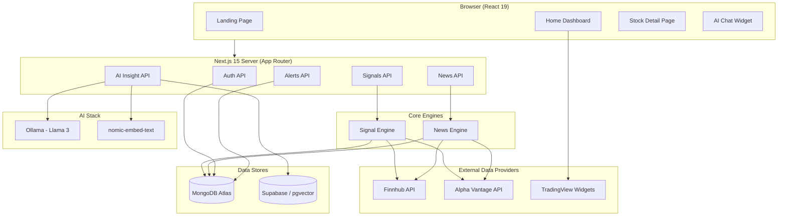
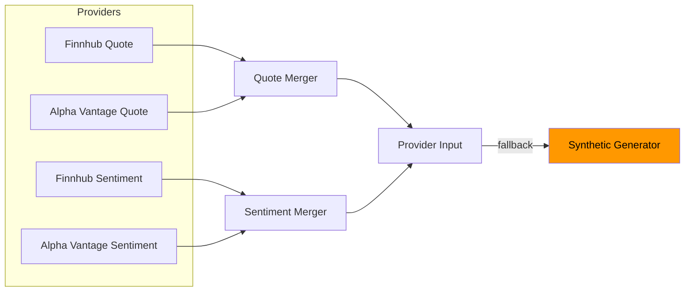
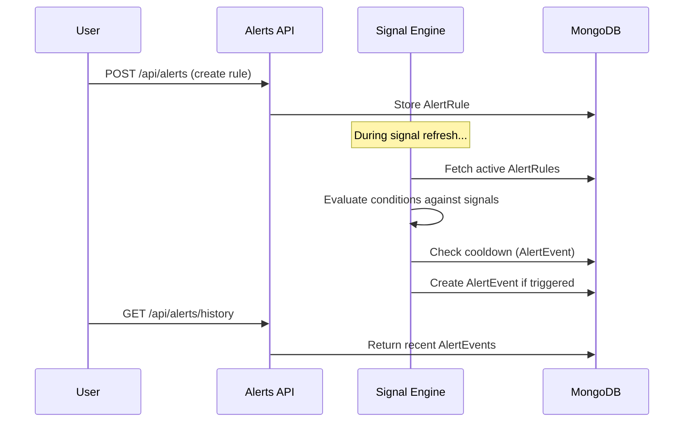
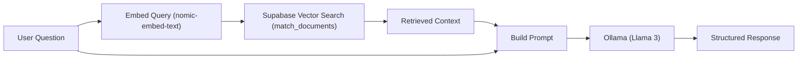

# SignaList — Implementation Documentation

> **SignaList** is a real-time stock market analysis platform built with Next.js 15, MongoDB, and AI-augmented insights. It combines multi-provider financial data, a custom signal-scoring engine, composite alerting, sentiment-aware news aggregation, and an AI chatbot with Retrieval-Augmented Generation (RAG).

---

## Table of Contents

1. [System Architecture](#1-system-architecture)
2. [Technology Stack](#2-technology-stack)
3. [Project Structure](#3-project-structure)
4. [Data Layer](#4-data-layer)
5. [Authentication System](#5-authentication-system)
6. [Signal Ranking Engine](#6-signal-ranking-engine)
7. [News Aggregation Engine](#7-news-aggregation-engine)
8. [Composite Alerts System](#8-composite-alerts-system)
9. [AI Insight Chat (RAG Pipeline)](#9-ai-insight-chat-rag-pipeline)
10. [Data Scraper & Embedding Pipeline](#10-data-scraper--embedding-pipeline)
11. [API Reference](#11-api-reference)
12. [Frontend Architecture](#12-frontend-architecture)
13. [Environment Configuration](#13-environment-configuration)
14. [Setup & Running](#14-setup--running)
15. [Known Limitations](#15-known-limitations)

---

## 1. System Architecture



**Data flow overview:**
1. The **Signal Engine** fetches quotes and sentiment from Finnhub and Alpha Vantage, computes a weighted multi-factor score, persists results to MongoDB, and evaluates user alert rules.
2. The **News Engine** aggregates financial news from both providers, applies sentiment labels, and stores articles in MongoDB.
3. The **AI Insight API** uses a RAG pipeline: it embeds the user's query via Ollama (`nomic-embed-text`), retrieves relevant context from Supabase (pgvector), and generates a response using Llama 3.
4. **TradingView** embedded widgets provide charts, heatmaps, and market data directly in the client.

---

## 2. Technology Stack

| Layer | Technology | Version |
|-------|-----------|---------|
| **Framework** | Next.js (App Router, Turbopack) | 15.5.5 |
| **Language** | TypeScript | 5.x |
| **UI Library** | React | 19.1.0 |
| **Styling** | Tailwind CSS | 4.x |
| **UI Primitives** | Radix UI (Avatar, Dropdown, Label, Popover, Select, Slot) | Latest |
| **Database** | MongoDB Atlas via Mongoose | 9.0.0 |
| **Vector DB** | Supabase (pgvector) | — |
| **LLM** | Ollama (Llama 3 local) | — |
| **Embeddings** | nomic-embed-text via LangChain/Ollama | — |
| **LLM Framework** | LangChain | 1.2.18 |
| **Market Data** | Finnhub API, Alpha Vantage API | — |
| **Charts** | TradingView Embedded Widgets | — |
| **Financial Data** | yahoo-finance2 (scraper) | 3.13.0 |
| **Icons** | Lucide React | — |
| **Markdown** | react-markdown | 10.x |
| **Forms** | react-hook-form | 7.x |

---

## 3. Project Structure

```
SignaList/
├── app/                          # Next.js App Router
│   ├── page.tsx                  # Landing page (public)
│   ├── layout.tsx                # Root layout (ThemeProvider, fonts)
│   ├── globals.css               # Global styles & design tokens
│   ├── (auth)/                   # Auth route group
│   │   ├── layout.tsx            # Centered auth layout
│   │   ├── sign-in/page.tsx      # Login form
│   │   └── sign-up/page.tsx      # Registration form
│   ├── app/                      # Authenticated app route group
│   │   ├── layout.tsx            # Dashboard layout (Header, Ticker, AI Chat)
│   │   ├── page.tsx              # Home dashboard
│   │   ├── signals/page.tsx      # Stock detail page
│   │   ├── news/page.tsx         # News feed page
│   │   └── profile/page.tsx      # User profile page
│   └── api/                      # Server-side API routes
│       ├── auth/{login,register,logout,me}/
│       ├── signals/{route,recompute,[symbol]}/
│       ├── alerts/{route,[id],history}/
│       ├── news/{route,personalized}/
│       └── ai/insight/
├── components/                   # React components
│   ├── landing/                  # Landing page sections
│   ├── ui/                       # Radix-based UI primitives
│   ├── Forms/                    # Form field components
│   ├── HomeDashboard.tsx         # Main dashboard orchestrator
│   ├── SignalLeaderboard.tsx     # Signal ranking table + detail panel
│   ├── CompositeAlertsPanel.tsx  # Alert rule builder + history
│   ├── NewsFeed.tsx              # News articles with filters
│   ├── StockDetailDashboard.tsx  # Per-symbol detail page
│   ├── AiInsightChat.tsx         # Floating AI chat widget
│   ├── Header.tsx                # Navigation header
│   ├── HeatmapSwitcher.tsx       # Multi-type TradingView heatmap
│   ├── TickerTapeWidget.tsx      # Scrolling market ticker
│   ├── TradingViewWidget.tsx     # Reusable TradingView embed
│   └── ThemeProvider.tsx         # Dark/light theme context
├── lib/                          # Core business logic
│   ├── signal-engine.ts          # Multi-factor signal scoring (882 lines)
│   ├── news-engine.ts            # News aggregation + sentiment (506 lines)
│   ├── alerts.ts                 # Alert validation utilities
│   ├── auth.ts                   # Password hashing (scrypt)
│   ├── session.ts                # Session token resolution
│   ├── constants.ts              # Widget configs, stock symbols
│   └── utils.ts                  # Tailwind merge utility
├── models/                       # Mongoose schemas
│   ├── User.ts                   # User profile + preferences
│   ├── Session.ts                # Token-based sessions (TTL)
│   ├── SignalProfile.ts          # Latest signal per symbol
│   ├── SignalSnapshot.ts         # Historical signal snapshots
│   ├── AlertRule.ts              # User-defined composite alert rules
│   ├── AlertEvent.ts             # Alert trigger event log
│   └── NewsArticle.ts            # Aggregated news articles
├── scripts/                      # CLI utilities
│   └── scrape-finance.ts         # Yahoo Finance → Supabase RAG pipeline
├── Database/
│   └── Mongoose.ts               # MongoDB connection (cached singleton)
├── types/
│   └── global.d.ts               # Global TypeScript declarations
└── Hooks/
    └── UseTradingViewWidget.tsx   # TradingView script loader hook
```

---

## 4. Data Layer

### 4.1 MongoDB Connection

The database connection is managed as a cached singleton in `Database/Mongoose.ts` to avoid redundant connections in serverless/edge environments:

```typescript
// Singleton pattern — conn is cached across hot reloads
let cached = global.mongooseCache;
if (!cached) {
  cached = global.mongooseCache = { conn: null, promise: null };
}
```

### 4.2 Data Models

#### User
| Field | Type | Notes |
|-------|------|-------|
| `fullName` | String | Required, trimmed |
| `email` | String | Required, unique, lowercase |
| `passwordHash` | String | scrypt hash (`salt.derivedKey`) |
| `country` | String | Selected during registration |
| `investmentGoals` | String | Growth / Income / Balanced / Conservative |
| `riskTolerance` | String | Low / Medium / High |
| `preferredIndustry` | String | Technology / Healthcare / Finance / Energy / Consumer Goods |

#### Session
| Field | Type | Notes |
|-------|------|-------|
| `userId` | ObjectId | References `User` |
| `token` | String | 32-byte random hex, unique, indexed |
| `expiresAt` | Date | TTL-indexed; auto-expires via MongoDB |

#### SignalProfile
Stores the **latest computed signal** per stock symbol for fast reads.

| Key Fields | Description |
|-----------|-------------|
| `symbol` | Unique, uppercase stock ticker |
| `score` | Composite strength score (0-100) |
| `scoreDelta` | Change vs. previous snapshot |
| `confidence` | Data reliability estimate (0-1) |
| `factors[]` | Per-factor breakdown (name, label, score, weight, contribution, direction) |
| `narrative` | Auto-generated plain-language explanation |
| `source` | `hybrid` / `finnhub` / `alpha_vantage` / `synthetic` |
| `providerMeta` | Boolean flags for which providers succeeded |
| `avgVolume`, `volumeStd`, `volatility` | Rolling statistical baselines |
| `lastMode` | `intraday` or `batch` |
| `lastComputedAt` | Timestamp of last computation |

#### SignalSnapshot
Time-series collection storing **historical signal snapshots** for trend visualization. Same fields as `SignalProfile` plus a `timestamp` field. Compound index on `(symbol, timestamp)`.

#### AlertRule
| Field | Type | Description |
|-------|------|-------------|
| `userId` | ObjectId | Owner (indexed) |
| `name` | String | Human-readable rule name |
| `symbols[]` | String[] | Scope (empty = all symbols) |
| `conditions[]` | Embedded | `{field, operator, value}` |
| `logic` | Enum | `AND` or `OR` |
| `cooldownMinutes` | Number | 1-1440, prevents spam |
| `isActive` | Boolean | Pause/resume toggle |
| `lastTriggeredAt` | Date | Last trigger timestamp |

#### AlertEvent
Stores **triggered alert events** linked to rules. Includes the signal metrics at trigger time and the `matchedConditions` for audit.

#### NewsArticle
| Key Fields | Description |
|-----------|-------------|
| `externalId` | SHA-256 hash of URL + publishedAt (dedup key) |
| `title`, `summary`, `url`, `source`, `imageUrl` | Article metadata |
| `category` | Inferred: technology, finance, energy, healthcare, consumer_goods, economy, general |
| `overallSentiment` | Numeric (-1 to 1) |
| `sentimentLabel` | Bullish / Somewhat-Bullish / Neutral / Somewhat-Bearish / Bearish |
| `tickerSentiments[]` | Per-symbol relevance and sentiment scores |
| `provider` | `finnhub` or `alpha_vantage` |

---

## 5. Authentication System

### Implementation Details

Authentication uses a **custom session-based system** (no third-party auth providers):

1. **Password Hashing** (`lib/auth.ts`):
   - Uses Node.js `crypto.scrypt` with a 16-byte random salt
   - 64-byte derived key; stored as `salt.derivedKey` (hex)
   - Verification uses `crypto.timingSafeEqual` to prevent timing attacks

2. **Session Tokens**:
   - 32-byte cryptographically random tokens (`crypto.randomBytes`)
   - Stored in MongoDB `Session` collection with 7-day TTL
   - MongoDB auto-deletes expired sessions via TTL index (`expires: 0`)

3. **Cookie Management**:
   - `httpOnly` cookie named `session`
   - `sameSite: 'lax'`, `secure` in production
   - 7-day `maxAge`

4. **Auth Flow**:
   - `POST /api/auth/register` — Creates user + session → sets cookie
   - `POST /api/auth/login` — Validates credentials → creates session → sets cookie
   - `POST /api/auth/logout` — Deletes session + clears cookie
   - `GET /api/auth/me` — Returns current user profile from session token

5. **Route Protection**:
   - The `app/app/layout.tsx` is a server component that reads the session cookie via `cookies()`, calls `getUserFromSession()`, and redirects to `/sign-in` if unauthenticated.

---

## 6. Signal Ranking Engine

**File:** `lib/signal-engine.ts` (882 lines)

This is the core algorithmic component of SignaList. It computes a composite strength score (0-100) for each stock symbol using a multi-factor weighted model.

### 6.1 Data Acquisition

The engine fetches data from multiple providers concurrently with fallback logic:



- **Finnhub**: Real-time quotes (`/quote`) and news sentiment (`/news-sentiment`)
- **Alpha Vantage**: Global quotes (`GLOBAL_QUOTE`) and news sentiment (`NEWS_SENTIMENT`)
- **Synthetic Fallback**: Deterministic pseudo-random data seeded from `symbol + date` when both providers fail
- All fetches use an 8-second timeout (`AbortController`)
- Concurrency limited to 6 parallel symbol fetches

### 6.2 Factor Weights

| Factor | Weight | What It Measures |
|--------|--------|-----------------|
| **Momentum** | 30% | Recent price change direction/strength (±6% range normalized) |
| **Volume Anomaly** | 20% | Z-score of volume vs. rolling average/std |
| **News Sentiment** | 20% | Aggregated sentiment from provider endpoints (-1 to +1) |
| **Volatility Regime** | 15% | Penalty for extreme volatility; optimal around 2% |
| **Provider Agreement** | 15% | Cross-provider quote consistency (price divergence) |

### 6.3 Score Computation

```
score = Σ (factor_score × factor_weight)   clamped to [0, 100]
```

Each factor is normalized to 0-100 before weighting. The contribution of each factor is calculated as:
```
contribution = ((factor_score - 50) / 50) × weight × 100
```

### 6.4 Rolling Statistics

The engine maintains exponentially weighted moving averages for:
- **avgVolume**: `previous × 0.8 + current × 0.2`
- **volumeStd**: `sqrt(previous² × 0.8 + deviation² × 0.2)`
- **volatility**: `previous × 0.7 + |changePercent| × 0.3`

### 6.5 Confidence Score

Confidence is computed heuristically based on data quality:

| Factor | Contribution |
|--------|-------------|
| Base confidence | +0.35 |
| Per live provider (×2 max) | +0.20 each |
| Has sentiment data | +0.15 |
| Has previous snapshot | +0.10 |
| Batch mode | +0.05 |
| Synthetic fallback | −0.15 |

Clamped to `[0.15, 0.98]`.

### 6.6 Narrative Generation

The engine auto-generates a plain-language explanation:
- Identifies the **strongest factor** by absolute contribution
- Reports score movement vs. previous snapshot
- Describes positive/negative pressure dynamics

Example: *"Score 72.4 (up 3.1 pts vs last snapshot). Primary driver: momentum (+8.2). Positive pressure from momentum offsets weakness in volatility regime."*

### 6.7 Refresh Behaviour

| Mode | Interval | Alpha Vantage Sentiment |
|------|----------|------------------------|
| `intraday` | 5 minutes | Not fetched (rate limit conservation) |
| `batch` | 60 minutes | Fetched (deeper analysis) |

- A **single-flight lock** prevents duplicate concurrent refreshes
- `ensureFreshSignals()` checks staleness before triggering
- `triggerSignalRefresh()` forces immediate recompute

### 6.8 Score Bands

| Range | Label |
|-------|-------|
| 80-100 | Strong Bullish |
| 65-79 | Bullish |
| 50-64 | Neutral |
| 35-49 | Cautious |
| 0-34 | High Risk |

---

## 7. News Aggregation Engine

**File:** `lib/news-engine.ts` (506 lines)

### 7.1 Fetching

| Provider | Endpoint | Cooldown | Limit |
|----------|----------|----------|-------|
| Finnhub | `/news?category=general` | 2 minutes | 50 articles |
| Alpha Vantage | `NEWS_SENTIMENT` | 15 minutes | 50 articles |

### 7.2 Processing Pipeline

1. **Deduplication**: Each article generates a SHA-256 `externalId` from `url + publishedAt`
2. **Category Inference**: Maps symbols to categories via `SYMBOL_CATEGORY_MAP`, then falls back to keyword matching in the title
3. **Sentiment Normalization**: Alpha Vantage labels (`Somewhat_Bullish`) are normalized to a consistent format (`Somewhat-Bullish`)
4. **Ticker Extraction**: Per-ticker sentiment scores are extracted from Alpha Vantage responses
5. **Persistence**: Bulk upsert using `$setOnInsert` to avoid overwriting existing articles

### 7.3 Query Capabilities

- **General feed**: Filter by `symbol`, `sentiment`, `category`, with pagination
- **Personalized feed**: Matches by `trackedSymbols` OR `preferredIndustry` (from user profile)
- **Cleanup**: Deletes articles older than 7 days by default

---

## 8. Composite Alerts System

### 8.1 Architecture



### 8.2 Condition Evaluation

Each rule has one or more conditions that reference signal fields:

**Available fields:** `score`, `scoreDelta`, `sentiment`, `volumeZScore`, `confidence`, `changePercent`

**Operators:** `>`, `>=`, `<`, `<=`, `==`

**Logic modes:** `AND` (all conditions must match) or `OR` (any condition matches)

### 8.3 Cooldown Mechanism

Each rule has a `cooldownMinutes` (1-1440). Before firing, the engine checks if an `AlertEvent` with the same `ruleId + symbol` was created within the cooldown window. This prevents alert spam.

### 8.4 Pre-built Templates

The frontend provides ready-to-use templates:
| Template | Conditions |
|----------|-----------|
| Momentum Breakout | score ≥ 70 AND sentiment ≥ 0.1 |
| Volume Spike | volumeZScore ≥ 2 AND score ≥ 55 |
| Sentiment Divergence | score ≤ 45 AND sentiment ≥ 0.15 AND scoreDelta ≥ 1 |

---

## 9. AI Insight Chat (RAG Pipeline)

**API:** `POST /api/ai/insight` → **Component:** `AiInsightChat.tsx`

### 9.1 RAG Architecture



### 9.2 Topic Detection

The system automatically detects which sections to include based on keywords in the user's question:

| Section | Trigger Keywords |
|---------|-----------------|
| Overview | overview, about, what is, explain |
| Risks | risk, danger, downside, threat |
| Valuation | valuation, value, P/E, earnings |
| Trend | trend, momentum, bullish, bearish |
| Catalysts | catalyst, upcoming, event, growth driver |
| Summary | summary, TLDR |

If no keywords match or only "overview" matches, all sections are returned.

### 9.3 Rate Limiting

| Protection | Configuration |
|-----------|--------------|
| Min interval between requests | 2 seconds |
| Max requests per window | 5 per 60 seconds |
| Response cache TTL | 15 minutes |

### 9.4 Context Source

The RAG context comes from the **scraper pipeline** (see Section 10) which stores Yahoo Finance data as vector embeddings in Supabase. The API retrieves the top 3 matching documents with a similarity threshold of 0.1.

---

## 10. Data Scraper & Embedding Pipeline

**File:** `scripts/scrape-finance.ts`

A CLI script that fetches comprehensive stock data from Yahoo Finance and stores it as vector embeddings in Supabase for RAG retrieval.

### 10.1 Data Collected Per Symbol

| Category | Fields |
|----------|--------|
| Company Overview | Sector, industry, employees, business description |
| Market Data | Price, change, market cap, 52-week range, avg volume |
| Valuation | Forward P/E, PEG, P/B, EV, beta, trailing P/E |
| Financial Health | Revenue, growth, margins, ROE, D/E, FCF, op. cash flow |
| Analyst Consensus | Recommendation, target price range, analyst count, buy/sell distribution |
| Earnings | Recent quarterly EPS (actual vs. estimate) |
| Forward Estimates | EPS estimates with growth rates |
| Calendar Events | Earnings dates, dividend dates |

### 10.2 Embedding Pipeline

1. Raw text is split using `RecursiveCharacterTextSplitter` (1500 chars, 300 overlap)
2. Embeddings generated via Ollama (`nomic-embed-text`)
3. Stored in Supabase `documents` table via `SupabaseVectorStore`
4. Old documents for the same symbol are cleared before re-ingestion

### 10.3 Usage

```bash
# Single symbol
npx tsx scripts/scrape-finance.ts AAPL

# All 50 popular symbols
npx tsx scripts/scrape-finance.ts ALL
```

The `ALL` mode includes a 2-second delay between symbols to avoid Yahoo Finance rate limiting.

---

## 11. API Reference

### Authentication

| Method | Endpoint | Auth | Description |
|--------|----------|------|-------------|
| `POST` | `/api/auth/register` | No | Create account; returns user + sets session cookie |
| `POST` | `/api/auth/login` | No | Validate credentials; returns user + sets session cookie |
| `POST` | `/api/auth/logout` | Yes | Deletes session and clears cookie |
| `GET` | `/api/auth/me` | Yes | Returns current user profile |

### Signals

| Method | Endpoint | Auth | Description |
|--------|----------|------|-------------|
| `GET` | `/api/signals` | No | Returns ranked signal list with data status |
| `GET` | `/api/signals/[symbol]` | No | Returns single symbol detail + 24 history snapshots |
| `POST` | `/api/signals/recompute` | Yes | Triggers intraday or batch recompute |

**Query parameters for `GET /api/signals`:**

| Param | Type | Default | Description |
|-------|------|---------|-------------|
| `limit` | number | 20 | Max results (1-100) |
| `mode` | string | `intraday` | `intraday` or `batch` |
| `symbols` | string | Top 40 | Comma-separated symbol list |
| `refresh` | string | — | Set to `1` to force refresh |

**Response fields:**

| Field | Description |
|-------|-------------|
| `items[]` | Array of `SignalProfileView` objects |
| `dataStatus` | `live`, `partial_fallback`, or `fallback` |
| `fallbackRatio` | Fraction of synthetic data |
| `syntheticCount` / `liveCount` | Provider coverage breakdown |

### Alerts

| Method | Endpoint | Auth | Description |
|--------|----------|------|-------------|
| `GET` | `/api/alerts` | Yes | List user's alert rules |
| `POST` | `/api/alerts` | Yes | Create a new alert rule |
| `PATCH` | `/api/alerts/[id]` | Yes | Update an existing rule |
| `DELETE` | `/api/alerts/[id]` | Yes | Delete a rule |
| `GET` | `/api/alerts/history` | Yes | List recent trigger events |

### News

| Method | Endpoint | Auth | Description |
|--------|----------|------|-------------|
| `GET` | `/api/news` | No | Filtered news feed |
| `GET` | `/api/news/personalized` | Yes | News filtered by user preferences |

**Query parameters for `GET /api/news`:**

| Param | Type | Default | Description |
|-------|------|---------|-------------|
| `symbol` | string | — | Filter by ticker symbol |
| `sentiment` | string | — | `bullish`, `bearish`, or `neutral` |
| `category` | string | — | e.g., `technology`, `finance` |
| `page` | number | 1 | Pagination page |
| `limit` | number | 20 | Results per page (1-50) |

### AI Insight

| Method | Endpoint | Auth | Description |
|--------|----------|------|-------------|
| `POST` | `/api/ai/insight` | No | RAG-augmented AI stock analysis |

**Request body:** `{ symbol: string, question?: string }`

**Response:** `{ text: string, ragSources: number, cached: boolean }`

---

## 12. Frontend Architecture

### 12.1 Route Structure

| Route | Component | Access |
|-------|-----------|--------|
| `/` | Landing Page (Navbar, Hero, Features, Market Preview, CTA, Footer) | Public |
| `/sign-in` | Login form | Public |
| `/sign-up` | Multi-step registration form | Public |
| `/app` | Home Dashboard | Authenticated |
| `/app/signals?symbol=X` | Stock Detail Page | Authenticated |
| `/app/news` | News Feed | Authenticated |
| `/app/profile` | User Profile | Authenticated |

### 12.2 Key Components

**HomeDashboard** — Orchestrates:
- `HeatmapSwitcher` — Multi-type TradingView heatmap (Stocks, Crypto, ETF, Forex)
- `SignalLeaderboard` — Signal ranking table with expandable detail panel
- `CompositeAlertsPanel` — Alert rule builder, active rules list, trigger history

**SignalLeaderboard** (653 lines) — Features:
- Sortable table with columns: Symbol, Strength, Move, News, Confidence
- Clickable rows expand to show: narrative, factor impact bars, trend history
- Quick Refresh and Deep Recompute buttons
- Score band color coding and source labels

**CompositeAlertsPanel** (723 lines) — Features:
- Three tabs: Builder, Active Rules, Recent Triggers
- Dynamic condition form with field/operator/value pickers
- Pre-built templates (Momentum Breakout, Volume Spike, Sentiment Divergence)
- Human-readable rule preview
- Inline toggle/delete for active rules

**NewsFeed** (482 lines) — Features:
- Category and sentiment filter tabs
- Article cards with sentiment badges, provider labels, and ticker tags
- Load-more pagination
- Personalized tab using user industry preferences

**StockDetailDashboard** (431 lines) — Features:
- Signal summary card (score, confidence, factors, narrative)
- TradingView candlestick chart, technical analysis, company profile, and financials widgets
- Historical score trend visualization

**AiInsightChat** — Floating chat widget:
- Symbol selector with datalist autocomplete
- Markdown-rendered assistant responses with section headings
- RAG source indicator (green/orange dot with source count)
- Rate limit countdown timer
- Cooldown enforcement

### 12.3 Theme System

The `ThemeProvider` manages dark/light mode:
- Default: `dark`
- Stored in `localStorage`
- Applied via `class` attribute on `<html>` element
- TradingView widgets dynamically adapt via theme prop

---

## 13. Environment Configuration

Create a `.env.local` file in the `SignaList/` root:

```env
# MongoDB
MONGODB_URL=mongodb+srv://...

# Financial Data Providers
FINNHUB_API_KEY=your_finnhub_key
ALPHA_VANTAGE_API_KEY=your_alpha_vantage_key

# Supabase (for RAG vector store)
NEXT_PUBLIC_SUPABASE_URL=https://your-project.supabase.co
NEXT_PUBLIC_SUPABASE_ANON_KEY=your_anon_key
SUPABASE_SERVICE_ROLE_KEY=your_service_role_key
```

**Notes:**
- The signal engine gracefully falls back to synthetic data if API keys are missing
- Ollama must be running locally on `http://127.0.0.1:11434` for AI features
- Restart the dev server after changing `.env.local`

---

## 14. Setup & Running

### Prerequisites

- Node.js 18+
- MongoDB Atlas cluster (or local MongoDB)
- Ollama installed locally with models: `llama3`, `nomic-embed-text`
- Supabase project with `documents` table and `match_documents` RPC function

### Installation

```bash
cd SignaList
npm install
```

### Running the Development Server

```bash
npm run dev
```

The app runs at `http://localhost:3000` with Turbopack for fast rebuilds.

### Populating RAG Data

```bash
# Pull required Ollama models
ollama pull llama3
ollama pull nomic-embed-text

# Scrape and embed stock data
npx tsx scripts/scrape-finance.ts ALL
```

### Verification Endpoints

| URL | Expected |
|-----|----------|
| `http://localhost:3000/api/signals?limit=5` | JSON with `items[]`, `dataStatus` |
| `http://localhost:3000/api/signals?symbols=AAPL&limit=1&refresh=1` | Single-symbol signal data |
| `http://localhost:3000/api/news?limit=5` | News articles with sentiment labels |
| `http://localhost:3000/api/auth/me` | Current user (requires session cookie) |

---

## 15. Known Limitations

- **Provider rate limits** can cause partial fallback states even with valid API keys
- **Confidence** is heuristic, not ML-calibrated
- **Alerts are in-app only** — no email, SMS, or push notifications
- **Score weights are static** — not machine-learned or adaptive
- **Scraper must be run manually** — no automated scheduling for RAG data refresh
- **Single LLM model** — Llama 3 via local Ollama only; no cloud LLM fallback
- **No test suite** — unit and integration tests are not yet implemented

---

*This project is for educational and research purposes. It does not provide financial advice.*
